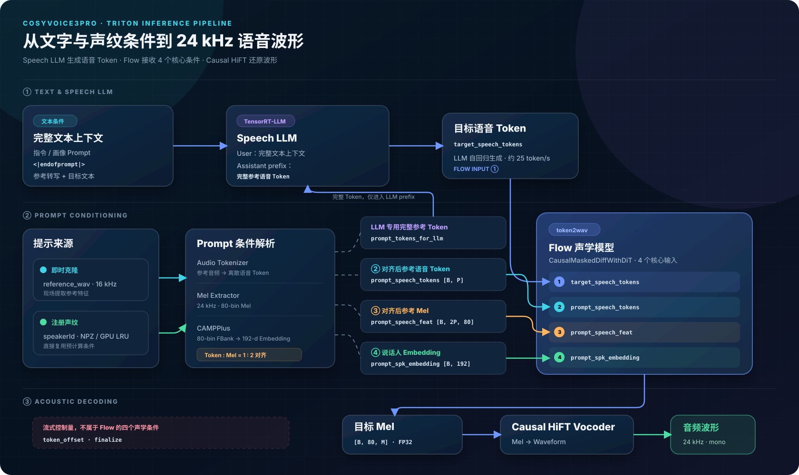

<div align="center">

# CosyVoice3Pro

### Production-ready CosyVoice serving

**Register once. Speak many times.**

基于 NVIDIA Triton Inference Server 与 TensorRT-LLM 的<br>
高性能语音克隆服务、可复用 Speaker Registry、开发者友好 API 与 Web 工作台

[](https://www.python.org/)
[](https://github.com/QuadraV-Speech/CosyVoice3Pro/actions/workflows/ci.yml)
[](https://github.com/QuadraV-Speech/CosyVoice3Pro/releases)
[](LICENSE)
[](https://github.com/triton-inference-server/server)
[](https://github.com/NVIDIA/TensorRT-LLM)
[](https://www.docker.com/)
[](#api-入口)
[](docs/benchmark.md)

[English](README_EN.md) ·
[快速开始](#快速开始) ·
[实测性能](#实测性能) ·
[Web 后台](#web-管理后台) ·
[对外 API](docs/public-api.md) ·
[部署运维](docs/web-admin.md) ·
[参与贡献](#参与贡献)

</div>

---

> [!IMPORTANT]
> **CosyVoice3Pro = 官方 CosyVoice3 推理核心 + Speaker Registry +
> 开发者 API + 音频交付 + Web 与生产运维。**

参考音频注册一次，后续只传 `speakerId + text`；非空 `prompt` 可临时覆盖
Speaker 的默认画像。

## 官方 CosyVoice3 与 CosyVoice3Pro

| 维度 | 官方 CosyVoice3 Triton Runtime | CosyVoice3Pro |
| --- | --- | --- |
| 模型 | `Fun-CosyVoice3-0.5B-2512` | **相同官方模型与 TensorRT-LLM 核心** |
| 调用 | Triton V2 / gRPC Tensor | **REST、表单、音频流，curl 即用** |
| 声纹 | 默认传参考音频；可选进程内缓存 | **持久化多 Speaker，完整 CRUD** |
| Prompt | 客户端组织参考文本/指令 | **注册默认画像，请求级覆盖** |
| 输入与输出 | 客户端准备 Tensor、处理波形 | **文件/URL 注册，长文本、语速、音量、9 种格式** |
| 管理与运维 | Triton 原生能力 | **同端口 Web、健康检查、耗时头、自动性能 Profile** |
| 流式能力 | 高级 gRPC Decoupled 调用 | **Public SSE、浏览器边收边播、curl 可用** |

CosyVoice3Pro 是社区服务化增强版，并非 FunAudioLLM 官方发行版。

<div align="center">
  <a href="docs/assets/web-console.png">
    
  </a>
  <sub>真实服务演示：选择 Speaker → 设置画像与文本 → SSE 边生成边播 → 查看耗时并下载</sub>
</div>

## 实测性能

系统 RTF 与官方口径一致：`整组墙钟时间 / 全部输出音频总时长`。

### A100 受控对比

同一硬件、模型、Engine、业务链路和请求，仅改变服务 Profile：

| A100-SXM4-80GB 配置 | 成功率 | P50 | P95 | 系统 RTF | 音频吞吐 |
| --- | ---: | ---: | ---: | ---: | ---: |
| 官方默认核心参数复现 | 48/48 | 3.67s | 4.41s | 0.0391 | 25.61x |
| **CosyVoice3Pro `throughput`** | **48/48** | **3.40s** | **4.22s** | **0.0329** | **30.42x** |

系统 RTF 降低 **15.8%**，音频吞吐提升 **18.8%**。第一行是同链路复现，
不是官方发布的 A100 数字。

### 官方 L20 基线

来自
[官方 CosyVoice3 Triton 文档](https://github.com/FunAudioLLM/CosyVoice/blob/074ca6dc9e80a2f424f1f74b48bdd7d3fea531cc/runtime/triton_trtllm/README.Cosyvoice3.md)：

| 官方模式 | 并发 / Batch | 官方结果 |
| --- | ---: | --- |
| 流式首包 | 并发 4 | Avg 750.42 ms；P50 740.31；P90 941.05；P95 977.55；P99 1002.37 |
| 离线流水线 | Batch 1 | RTF 0.1091 |
| 离线流水线 | Batch 2 | RTF 0.0822 |
| 离线流水线 | Batch 4 | RTF 0.0630 |
| 离线流水线 | Batch 8 | RTF 0.0562 |
| 离线流水线 | Batch 16 | RTF 0.0501 |

官方未发布 A100 结果；L20 流式/离线工作负载与 Pro 的 A100 端到端 HTTP
测试不同，不直接比较倍数。

### Pro 流式高并发

新增官方兼容评测器：相同 `seed_tts_cosy2/wenetspeech4tts` 数据、原始参考
音频、10 秒 padding、每任务一条持久 gRPC stream 和相同 TTFA 边界。

| 流式场景 | 并发 | 成功 | TTFA Avg | TTFA P95 | 系统 RTF | 音频吞吐 |
| --- | ---: | ---: | ---: | ---: | ---: | ---: |
| A100 raw prompt 稳态 | 4 | 26/26 | 622.25 ms | 906.20 ms | 0.1030 | 9.71x |
| A100 Public SSE 生产验收 | 16 | **100/100** | 1881.25 ms | **2281.99 ms** | **0.0586** | **17.05x** |

`streaming` Profile 在 registered Speaker 并发 16 A/B 中将 TTFA 平均降低
**16.2%**、P95 降低 **28.2%**。Public SSE 默认允许 16 路并发，提供排队
超时和断连清理；24 路客户端在首包前断开后，FFmpeg 残留进程为 0。
官方数据来自 L20，Pro 实测来自共享 A100，不能据此宣称跨硬件软件倍数。

### Pro 完整音频高并发

| 环境 | 并发 | 成功率 | P50 | P95 | 系统 RTF | 音频吞吐 |
| --- | ---: | ---: | ---: | ---: | ---: | ---: |
| A100-SXM4-80GB | 12 | 48/48 | 3.40s | 4.22s | **0.0329** | 30.42x |
| A100-SXM4-80GB | 16 | 48/48 | 4.41s | 5.42s | **0.0322** | 31.06x |
| A100-SXM4-80GB | 24 | 48/48 | 6.72s | 8.18s | **0.0331** | 30.19x |

完整变量、口径和复现命令见[性能基准文档](docs/benchmark.md)。
Flow/Vocoder 动态 Batch 已提供实验开关；A100 默认仍采用实测更快、更省显存
的静态 Batch 1，并按流式负载配置 2 个 Flow / 4 个 Vocoder 实例。

## 系统架构

```text
 Browser / SDK / curl
          │
          │ :18000
          ▼
 ┌─────────────────────────────────────────────┐
 │          CosyVoice3Pro Gateway              │
 │                                             │
 │ Public API                                  │
 │ /health · /register · /speakers             │
 │ /tts/ · /tts/stream (SSE)                   │
 │       ▲                                     │
 │       └──────── Web Admin 使用同一组 API     │
 │                                             │
 │ Advanced API                                │
 │ /v2/* ───────────────► Triton HTTP :18100   │
 └──────────────────────────┬──────────────────┘
                            ├── CosyVoice3Pro
                            ├── CosyVoice3ProStreaming
                            ├── Speaker Registry
                            └── upstream cosyvoice3

 gRPC :18001 · Metrics :18002
```

`18100` 仅供容器内部 Gateway 访问。业务开发优先使用 Public API；模型
调试和平台运维才需要 Advanced API。

### 模型推理链路

[](docs/inference-pipeline.html)

Flow 接收目标语音 Token、对齐后参考语音 Token、参考 Mel 和说话人
Embedding 四个核心条件。点击图片可查看张量级说明和流式调度边界。

## Public API

| 方法 | 地址 | 用途 |
| --- | --- | --- |
| `GET` | `/health` | 健康检查 |
| `POST` | `/register` | 文件或 URL 注册/更新声纹 |
| `GET` | `/speakers`、`/speakers/{speakerId}` | 查询声纹 |
| `DELETE` | `/speakers/{speakerId}` | 删除声纹 |
| `POST` | `/tts/` | 合成并返回处理后的音频 |
| `POST` | `/tts/stream` | SSE 边生成边播报 |
| `GET` | `/` | Web 工作台 |

## 快速开始

要求 Linux、Docker、NVIDIA Driver、NVIDIA Container Runtime 与 CUDA
GPU。首次安装需要下载源码、镜像和模型。

```bash
git clone https://github.com/QuadraV-Speech/CosyVoice3Pro.git
cd CosyVoice3Pro
COSYVOICE_GPU_ID=0 bash manage.sh install
```

```bash
curl --fail-with-body http://127.0.0.1:18000/health
```

Web 工作台：`http://服务器IP:18000/`

## 调用示例

### 注册声纹

```bash
curl --fail-with-body \
  -X POST "http://127.0.0.1:18000/register" \
  -H "Content-Type: application/json" \
  -d '{
    "speakerId": "narrator_01",
    "audio_url": "https://example.com/reference.mp3",
    "reference_text": "这是参考音频中实际说出的内容。",
    "prompt": "请用成熟、稳重、亲切的语气说话。"
  }'
```

也支持 `multipart/form-data` 文件上传。

### 合成音频

```bash
curl --fail-with-body \
  -X POST "http://127.0.0.1:18000/tts/" \
  -F "text=你好，这是 CosyVoice3Pro 统一语音接口。" \
  -F "speakerId=common_speaker_1" \
  -F "prompt=请用成熟、稳重、亲切的语气说话。" \
  -F "speed=balanced" \
  -F "volume=middle" \
  -F "output_format=mp3" \
  --output output.mp3
```

不传或传空 `prompt` 使用 Speaker 默认画像；非空值仅覆盖本次请求。
`/tts/` 也支持内置声音和直接上传 `prompt_audio`。更多 curl 见
[对外 API 文档](docs/public-api.md)。

### SSE 在线播报

```bash
curl --fail-with-body -N --no-buffer \
  -X POST "http://127.0.0.1:18000/tts/stream" \
  -F "text=你好，这段声音会边生成边返回。" \
  -F "speakerId=common_speaker_1" \
  -F "prompt=请自然、清晰地说话。"
```

返回 `meta → audio × N → done` 事件；`audio` 是 16kHz 单声道 Base64
PCM。网页会实时解码播放，完整的 curl + `ffplay` 示例见
[SSE 接口文档](docs/public-api.md#8-sse-在线流式合成)。

## 服务管理

```bash
bash manage.sh start
bash manage.sh stop
bash manage.sh restart
bash manage.sh status
bash manage.sh logs
bash manage.sh backup
```

Speaker 默认保存在 `data/speakers/`；`bash manage.sh backup` 可手动备份。
性能 Profile、环境变量和高级运维见[部署文档](docs/web-admin.md)。

高级接口继续保留：Triton HTTP `/v2/*`、gRPC `18001`、Metrics `18002`。

## 安全提示

服务默认不含应用层认证。公网部署请在反向代理或负载均衡层增加 TLS、
鉴权、限流、来源限制，并独立备份 Speaker 数据。

## 文档

- [对外开发者 API](docs/public-api.md)
- [内部 Triton 高级 API](docs/advanced-api.md)
- [性能基准与复现](docs/benchmark.md)
- [高并发流式推理优化技术报告](docs/technical-report-streaming-optimization.md)
- [Web Gateway 部署与运维](docs/web-admin.md)
- [版本变更记录](CHANGELOG.md)
- [安全策略](SECURITY.md)

## 开源许可

CosyVoice3Pro 的原创代码与文档使用
[Apache License 2.0](LICENSE)，归属声明见 [NOTICE](NOTICE)。

模型权重、基础镜像、CosyVoice、NVIDIA Triton、TensorRT-LLM 及其他上游
组件不因本仓库许可证而重新授权，仍分别受其原始许可证和使用条款约束。

## 参与贡献

欢迎提交 Bug、文档改进、GPU 兼容性结果、Benchmark 数据和 Pull Request。
提交前请阅读 [贡献指南](CONTRIBUTING.md)。仓库已经提供结构化 Bug/Feature
模板，界面变化请附截图，性能变化请附可复现命令和前后数据。

## 致谢与上游

CosyVoice3Pro 基于
[FunAudioLLM/CosyVoice](https://github.com/FunAudioLLM/CosyVoice)、
[NVIDIA Triton Inference Server](https://github.com/triton-inference-server/server)
与 [TensorRT-LLM](https://github.com/NVIDIA/TensorRT-LLM) 构建。

模型权重、基础镜像及上游组件分别受其原始许可证和使用条款约束。
