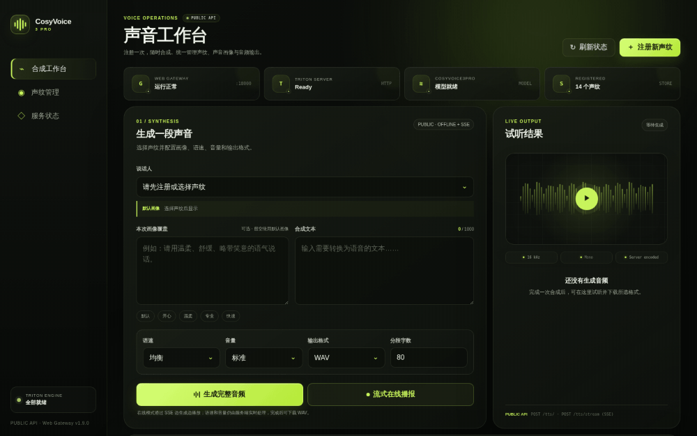

<div align="center">

# CosyVoice3Pro

### Production-ready CosyVoice serving

**Register once. Speak many times.**

High-performance voice cloning powered by NVIDIA Triton and TensorRT-LLM,<br>
with a reusable Speaker Registry, developer-friendly API, and Web console.

[](https://www.python.org/)
[](https://github.com/QuadraV-Speech/CosyVoice3Pro/actions/workflows/ci.yml)
[](https://github.com/QuadraV-Speech/CosyVoice3Pro/releases)
[](LICENSE)
[](https://github.com/triton-inference-server/server)
[](https://github.com/NVIDIA/TensorRT-LLM)
[](https://www.docker.com/)
[](#public-api)
[](docs/benchmark.md)

[中文](README.md) ·
[Quick Start](#quick-start) ·
[Benchmark](#measured-performance) ·
[Public API](docs/public-api.md) ·
[Operations](docs/web-admin.md)

</div>

---

> [!IMPORTANT]
> **Official CosyVoice3 solves high-quality generation; CosyVoice3Pro solves
> how to serve it efficiently and reliably to applications.** Pro retains the
> official model and advanced Triton APIs, then adds a persistent Speaker
> Registry, developer-friendly REST API, audio delivery, Web console, and
> A100-oriented concurrency profiles.

The most direct improvement is decoupling voice identity from inference:
register reference audio once, then synthesize with only `speakerId + text`.
A default Prompt persona can be stored with the speaker, while a non-empty
request `prompt` overrides it for one request.

## Official CosyVoice3 vs. CosyVoice3Pro

This comparison targets the
[official CosyVoice3 Triton Runtime](https://github.com/FunAudioLLM/CosyVoice/blob/074ca6dc9e80a2f424f1f74b48bdd7d3fea531cc/runtime/triton_trtllm/README.Cosyvoice3.md).
Pro uses the same `Fun-CosyVoice3-0.5B-2512` model and TensorRT-LLM inference
core. Its advantages are in production serving, not a claim to modify the
official model.

| Dimension | Official CosyVoice3 Triton Runtime | CosyVoice3Pro |
| --- | --- | --- |
| Model and quality | Official CosyVoice3 model | **Inherits the official model unchanged** |
| Application API | Triton V2 / gRPC Tensors with reference audio and text inputs | **Plain REST, forms, and audio streams; callable with curl** |
| Voice reuse | Reference audio by default; optional in-process cache without a persistent Speaker entity | **Register once, persist features, then send `speakerId`** |
| Multi-speaker lifecycle | No application-facing CRUD API | **Register, update, list, inspect, and delete** |
| Reuse across restarts | In-process cache ends with the service | **Persistent Speaker Registry with on-demand loading** |
| Prompt persona | Reference text/instructions assembled by each client | **Stored default plus one-request non-empty override** |
| Registration source | Client prepares audio Tensors | **Uploaded file or public audio URL** |
| Unified synthesis | Clients organize different inference inputs | **Built-in, Speaker ID, and instant cloning through `/tts/`** |
| Audio delivery | Model waveform; application handles delivery | **Speed, volume, long-text chunking, and nine formats** |
| Web management | No same-port application console in the Triton Runtime | **Same-port Web console built only on the Public API** |
| Concurrency tuning | Instance and KV parameters tuned manually | **GPU-memory-aware `balanced` / `throughput` profiles** |
| Observability | Native Triton metrics | **Metrics plus health and stage timing headers** |
| Streaming | Official decoupled streaming | Advanced Triton API retained; Public `/tts/` currently returns complete audio |

In short: **CosyVoice3Pro = the official CosyVoice3 inference core + reusable
voice identity + application API + deliverable audio + production operations.**

<div align="center">
  <a href="docs/assets/web-console.png">
    
  </a>
  <sub>Real service workflow: select a speaker → enter a persona and text → synthesize, preview, and download</sub>
</div>

> [!NOTE]
> CosyVoice3Pro is a community deployment project built on top of CosyVoice.
> It is not an official FunAudioLLM distribution. “Pro” refers to the serving
> and production-oriented capabilities added by this project.

## Measured performance

The following end-to-end measurement includes the Web Gateway, Speaker
Registry lookup, model inference, audio post-processing, and WAV response
transfer. System RTF follows the upstream aggregate definition:
`profile wall time / total synthesized audio duration`.

### Official defaults vs. Pro profile

Same A100, model, engine, application path, text, speaker, post-processing,
12-way concurrency, 48 requests, and 12 warm-up requests; only the service
profile changes:

| A100-SXM4-80GB configuration | Success | P50 | P95 | System RTF | Audio throughput |
| --- | ---: | ---: | ---: | ---: | ---: |
| Reproduced upstream default core settings | 48/48 | 3.67s | 4.41s | 0.0391 | 25.61x |
| **CosyVoice3Pro `throughput`** | **48/48** | **3.40s** | **4.22s** | **0.0329** | **30.42x** |

The Pro profile reduces system RTF by **15.8%** and raises audio throughput by
**18.8%**. The upstream-default row uses the same Pro Public API to control the
application path; it is not an officially published FunAudioLLM A100 number.

### Pro concurrency scaling

| GPU | Concurrency | Success | P50 | P95 | System RTF | Audio throughput |
| --- | ---: | ---: | ---: | ---: | ---: | ---: |
| A100-SXM4-80GB | 12 | 48/48 | 3.40s | 4.22s | **0.0329** | 30.42x |
| A100-SXM4-80GB | 16 | 48/48 | 4.41s | 5.42s | **0.0322** | 31.06x |
| A100-SXM4-80GB | 24 | 48/48 | 6.72s | 8.18s | **0.0331** | 30.19x |

See the [benchmark methodology and reproduction command](docs/benchmark.md).
It includes a variable-controlled A100 reproduction of the upstream default
configuration and the officially published L20 baseline. Upstream currently
publishes no A100 performance result. Results vary with GPU, text, voice, and
deployment configuration.

## Features

- Persistent Speaker Registry with register, inspect, list, update, and delete.
- Reusable prompt speech tokens, mel features, and CAMPPlus speaker embedding.
- Default speaker persona with per-request instruction override.
- Public HTTP API using regular JSON, forms, and audio streams.
- One `/tts/` endpoint for built-in voices, registered speakers, and raw prompt
  audio.
- Speaker registration from an uploaded audio file or a public audio URL.
- Long-text chunking, speed and volume control, and nine output formats.
- Web console for speaker management, synthesis, preview, and download.
- Triton `/v2/*`, gRPC, and Prometheus metrics retained for advanced use.

## Architecture

```text
 Browser / SDK / curl
          │
          │ :18000
          ▼
 ┌─────────────────────────────────────────────┐
 │          CosyVoice3Pro Gateway              │
 │                                             │
 │ Public API                                  │
 │ /health · /register · /speakers · /tts/     │
 │       ▲                                     │
 │       └──────── Web console uses the same API│
 │                                             │
 │ Advanced API                                │
 │ /v2/* ───────────────► Triton HTTP :18100   │
 └──────────────────────────┬──────────────────┘
                            ├── CosyVoice3Pro
                            ├── Speaker Registry
                            └── upstream cosyvoice3

 gRPC :18001 · Metrics :18002
```

Port `18100` is only used by the Gateway inside the container. Application
developers should use the Public API. Triton Tensor APIs are intended for model
engineering and platform operations.

## Quick start

### Requirements

- Linux
- Docker
- NVIDIA Driver and NVIDIA Container Runtime
- CUDA-capable NVIDIA GPU
- Network access for the initial image, source, and model downloads

### Install

```bash
git clone https://github.com/QuadraV-Speech/CosyVoice3Pro.git
cd CosyVoice3Pro
COSYVOICE_GPU_ID=0 bash manage.sh install
```

The installer creates the container, prepares CosyVoice and the TensorRT-LLM
engine, deploys the CosyVoice3Pro models and Speaker Registry, installs audio
encoding dependencies, and starts the same-port Web Gateway.

### Start and verify

```bash
bash manage.sh start

curl --fail-with-body \
  http://127.0.0.1:18000/health
```

Open the Web console at:

```text
http://SERVER_IP:18000/
```

## Public API

| Method | Endpoint | Purpose |
| --- | --- | --- |
| `GET` | `/health` | Service health |
| `POST` | `/register` | Register or update a speaker using a file or URL |
| `GET` | `/speakers` | List speakers |
| `GET` | `/speakers/{speakerId}` | Inspect one speaker |
| `DELETE` | `/speakers/{speakerId}` | Delete one speaker |
| `POST` | `/tts/` | Synthesize and return processed audio |
| `GET` | `/` | Web console |

The complete parameter and response reference is available in the
[Public API documentation](docs/public-api.md).

### Register from an audio URL

```bash
curl --fail-with-body \
  -X POST "http://127.0.0.1:18000/register" \
  -H "Content-Type: application/json" \
  -d '{
    "speakerId": "narrator_01",
    "audio_url": "https://example.com/reference.mp3",
    "reference_text": "The exact transcript of the reference audio.",
    "prompt": "Speak in a mature, composed, and friendly tone."
  }'
```

Audio file upload is also supported through `multipart/form-data`.

### Synthesize with a registered speaker

```bash
curl --fail-with-body \
  -X POST "http://127.0.0.1:18000/tts/" \
  -F "text=Hello from the unified CosyVoice3Pro speech API." \
  -F "speakerId=narrator_01" \
  -F "prompt=Speak clearly and naturally." \
  -F "speed=balanced" \
  -F "volume=middle" \
  -F "output_format=mp3" \
  --output output.mp3
```

Prompt resolution:

| Request | Behavior |
| --- | --- |
| `prompt` omitted | Use the speaker's stored default persona |
| `prompt=""` | Use the speaker's stored default persona |
| Non-empty `prompt` | Override the persona for this request only |

## Advanced APIs

| Endpoint | Purpose |
| --- | --- |
| `http://HOST:18000/v2/` | Triton HTTP API |
| `HOST:18001` | Triton gRPC |
| `http://HOST:18002/metrics` | Prometheus metrics |

See the [Advanced API documentation](docs/advanced-api.md) for Tensor
contracts, raw prompt inference, and internal Registry operations.

## Benchmark your deployment

```bash
python3 scripts/benchmark.py \
  --url http://127.0.0.1:18000 \
  --speaker-id common_speaker_1 \
  --concurrency 12 16 24 \
  --requests 48 \
  --warmup 12
```

The tool reports upstream-compatible system RTF, Average/P50/P90/P95/P99
full-response latency, and audio throughput using real WAV responses from the
Public API.

## Operations

```bash
bash manage.sh start
bash manage.sh stop
bash manage.sh restart
bash manage.sh status
bash manage.sh logs
bash manage.sh backup
```

| Variable | Default | Description |
| --- | --- | --- |
| `COSYVOICE_GPU_ID` | `3` | Host GPU assigned to Docker |
| `COSYVOICE_GIT_PROXY` | Current proxy or empty | Proxy used to fetch upstream code |
| `COSYVOICE_SPEAKER_STORE_DIR` | `data/speakers` | Persistent speaker storage |
| `COSYVOICE_WEB_GATEWAY_ENABLED` | `true` | Enable the same-port Web Gateway |
| `COSYVOICE_PERFORMANCE_PROFILE` | `auto` | Select `balanced` or `throughput` from GPU memory |
| `COSYVOICE_KV_CACHE_FRACTION` | Profile default | TensorRT-LLM KV-cache memory fraction |
| `COSYVOICE_PRO_BLS_INSTANCES` | Profile default | CosyVoice3Pro orchestration instances |
| `COSYVOICE_TOKEN2WAV_INSTANCES` | Profile default | Acoustic-model instances |
| `COSYVOICE_VOCODER_INSTANCES` | Profile default | Vocoder instances |
| `COSYVOICE_TTS_INFERENCE_CONCURRENCY` | Profile default | Gateway-wide inference limit |
| `COSYVOICE_TTS_SEGMENT_CONCURRENCY` | `2` | Per-request long-text segment limit |
| `COSYVOICE_PRO_EAGER_CUDA_INIT` | Profile default | Warm Pro CUDA contexts before readiness |

On an 80 GB GPU, `auto` enables the dual-token2wav, dual-vocoder throughput
profile. Smaller GPUs retain conservative single instances. Restart after
changing a performance variable. See the
[benchmark and tuning guide](docs/benchmark.md) for the exact profiles and A/B
results.

## Security

The Web console, speaker registration, TTS, and Triton APIs do not include
application-level authentication by default. A production deployment should
add TLS, authentication and authorization, source-IP restrictions, request
size limits, rate limits, and independent Speaker Registry backups at the
reverse-proxy or load-balancer layer.

## Contributing

Bug reports, documentation, compatibility results, benchmark data, and pull
requests are welcome. Read [CONTRIBUTING.md](CONTRIBUTING.md) before submitting
a change.

## License

Original CosyVoice3Pro code and documentation are licensed under the
[Apache License 2.0](LICENSE). See [NOTICE](NOTICE) for attribution.

Model weights, base images, CosyVoice, NVIDIA Triton, TensorRT-LLM, and other
upstream components retain their respective original licenses and terms.

## Documentation

- [Public API](docs/public-api.md)
- [Advanced Triton API](docs/advanced-api.md)
- [Benchmark](docs/benchmark.md)
- [Web Gateway operations](docs/web-admin.md)
- [Changelog](CHANGELOG.md)
- [Security Policy](SECURITY.md)

## Acknowledgements

CosyVoice3Pro is built on
[FunAudioLLM/CosyVoice](https://github.com/FunAudioLLM/CosyVoice),
[NVIDIA Triton Inference Server](https://github.com/triton-inference-server/server),
and [TensorRT-LLM](https://github.com/NVIDIA/TensorRT-LLM).

Model weights, base images, and upstream components remain subject to their
respective original licenses and terms of use.
