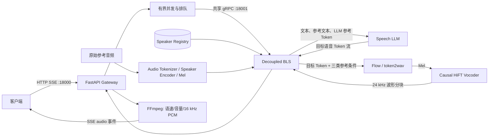

# CosyVoice3Pro 面向生产环境的高并发流式推理优化技术报告

> 文档版本：1.0<br>
> 对应服务版本：CosyVoice3Pro 1.9.0<br>
> 对应代码提交：`4d967c4`<br>
> 上游 CosyVoice 版本：`074ca6d`<br>
> 实验日期：2026-08-05

## 摘要

本文面向 CosyVoice3 Triton 推理服务在生产流式场景中的首音频延迟、并发
吞吐、资源争用和客户端断连资源泄漏问题，提出并实现了一套跨 Gateway、Triton
BLS、Speech LLM、Flow 声学模型、Causal HiFT Vocoder 和音频后处理的协同优化
方案。

方案的核心不是单纯增加模型实例，而是依据各阶段的服务时间和排队位置进行异构
容量重分配：减少与流式主链路竞争显存的离线 BLS 实例，将 Vocoder 从 2 个实例
扩展至 4 个实例，保持 2 个 Flow 实例；使用 15 个语音 Token 形成首块，首块后
采用增长分块减少 Flow/Vocoder 的重复调用；通过注册 Speaker 复用参考音频的多种
条件特征；在 Gateway 增加有界并发、排队超时、延迟创建 FFmpeg、共享 gRPC
连接，以及从客户端到 Triton BLS 的取消传播。

在相同 A100、模型、数据、客户端和采样参数下，registered Speaker 的 16 并发
直连 gRPC 测试中，TTFA 平均值由 1830.47 ms 降至 1533.39 ms，降低
**16.2%**；TTFA P95 由 3050.10 ms 降至 2189.18 ms，降低 **28.2%**。
26 并发下，TTFA 平均值和 P95 分别降低 **23.0%** 和 **26.0%**。Public SSE
在 16 并发、100 请求生产验收中实现 100/100 成功，TTFA P95 为 2281.99 ms，
系统 RTF 为 0.058638，音频吞吐为 17.05x。24 路客户端在首包前主动断开后，
3 秒内 FFmpeg 残留进程数保持为 0，服务继续处于 Ready 状态。

本文同时记录了 Flow/Vocoder 动态 Batch、更多 BLS/Flow 实例和更小首块等未被
最终采用的实验结果，以避免只报告正向结果。本文可作为技术论文、发明交底书和
后续专利权利要求设计的工程依据，但不替代新颖性检索、专利代理意见或法律结论。

## 1. 研究背景与目标

### 1.1 生产流式 TTS 的主要目标

离线 TTS 更关心单位时间生成的总音频时长，而在线播报、对话式语音和数字人更
关心用户多久能听到第一段声音。因此流式服务需要同时优化以下指标：

1. **TTFA（Time To First Audio）**：从提交推理请求到收到第一段非空音频的
   时间；
2. **尾延迟**：P95、P99 等高分位 TTFA，决定拥塞时的用户体验；
3. **系统 RTF**：整组请求墙钟时间与输出音频总时长之比；
4. **音频吞吐**：系统 RTF 的倒数，表示每秒墙钟时间可生成多少秒音频；
5. **可靠性**：请求失败率、排队过载行为、客户端断连后的资源回收；
6. **可复现性**：评测数据、客户端拓扑、计时边界和控制变量必须明确。

### 1.2 优化边界

本项目不修改 CosyVoice3 模型权重，不改变 Speech LLM 的采样参数，也不以降低
音质换取速度。优化集中在服务系统层：

- 参考条件的预计算与复用；
- 流式推理分块策略；
- 多阶段实例容量和 GPU 资源编排；
- Gateway 的并发、连接、后处理和取消生命周期；
- 与官方客户端一致的评测方法。

## 2. CosyVoice3 推理链路

### 2.1 总体链路



Triton 中的 BLS（Business Logic Scripting）是推理编排层。它不替代 Speech
LLM、Flow 或 Vocoder 的核心计算，而是负责准备条件、调用子模型、维护流式状态，
并通过 decoupled transaction policy 对一个请求发送多个音频响应。

### 2.2 参考条件与 Speech LLM 输入

参考音频首先被转换为多种用途不同的条件：

| 条件 | 主要用途 |
| --- | --- |
| `prompt_speech_tokens_for_llm` | Speech LLM 的声音上下文，保留完整参考语音 Token |
| `prompt_speech_tokens` | 与参考 Mel 对齐后的参考语音 Token，供 Flow 使用 |
| `prompt_speech_feat` | 参考音频的 80 维 Mel 特征，供 Flow 使用 |
| `prompt_spk_embedding` | CAMPPlus 说话人向量，供 Flow 保持音色一致性 |
| `reference_text` | 指令、参考音频转写和目标文本上下文的一部分 |

Speech LLM 接收目标文本、参考文本和 LLM 专用参考语音 Token，按流式方式生成目标
语音 Token。需要特别说明，`prompt_speech_tokens_for_llm` 与
`prompt_speech_tokens` 不是同一个逻辑张量：前者用于 LLM 上下文，后者按照
Mel 长度裁剪并对齐，用于声学模型条件。

### 2.3 Flow 的四个核心输入

Flow/token2wav 接收四个核心声学条件：

1. 目标语音 Token `target_speech_tokens`；
2. 对齐后的参考语音 Token `prompt_speech_tokens`；
3. 参考 Mel `prompt_speech_feat`；
4. 说话人 Embedding `prompt_spk_embedding`。

`token_offset` 和 `finalize` 用于控制流式增量计算，不是新的声学条件。Flow 输出
Mel，Causal HiFT Vocoder 再将 Mel 转换成 24 kHz 波形。

更详细的张量级图示见[推理链路交互图](inference-pipeline.html)。

### 2.4 当前流式生成算法

设 Speech LLM 已生成的语音 Token 数为 `N`，已消费偏移为 `o`，当前分块长度为
`h`，Flow 前视长度为 `p=3`。当满足以下条件时触发一次声学推理：

```text
N - o >= h + p
```

生产 Profile 取首块 `h₀=15`。第一块完成后，后续块采用增长策略：

```text
hᵢ = 25 × 2^(i + δ),  δ = 1
```

即首块保持较小以控制 TTFA，首块之后快速增加分块长度，从而减少 Flow 和
Vocoder 的调用次数。每次 Flow 返回新增 Mel，BLS 累积 Mel 后调用 Vocoder，
并依据 `speech_offset` 只发送尚未返回的音频后缀。

## 3. 基线问题与瓶颈诊断

### 3.1 参考音频重复计算

原始调用每次上传参考音频时，都可能重复执行音频解码、Audio Tokenizer、Speaker
Encoder、重采样和 Mel 提取。除了增加网络负担，这些操作还会在并发冷启动阶段
排队。官方兼容 raw prompt 测试中，冷/混合缓存 TTFA P95 达 2482.50 ms，而
稳态缓存为 906.20 ms，说明参考条件准备是明显的首轮尾延迟来源之一。

### 3.2 多阶段服务能力不匹配

Speech LLM、Flow 和 Vocoder 的执行时间、显存特征和请求到达模式不同。旧配置
将较多资源放在离线 Pro BLS，流式 BLS 等待下游时，Vocoder 队列成为主要瓶颈。
继续增加 BLS 只会产生更多在途任务，不能提高最慢阶段的服务率；增加第 3 个
Flow 又会导致 GPU 上下文和显存带宽竞争。

这一问题可用串联系统的近似关系表达：

```text
系统稳定吞吐 <= min(LLM 服务率, Flow 服务率, Vocoder 服务率)
```

因此实例数应依据最慢阶段和队列迁移进行配置，而不是所有模型同比扩容。

### 3.3 小分块带来的调用放大

减小首块可缩短等待 LLM Token 的时间，但若所有后续分块也保持很小，会增加
Flow/Vocoder 调用次数。在高并发下，多请求的首块更容易同时到达 Flow，进一步
形成 GPU 突发争用。实验中将首块从 15 降至 12，虽然单请求更早具备触发条件，
但 16 并发的音频吞吐下降到 13.83x，TTFA 平均值为 1632 ms，未优于最终方案。

### 3.4 无界等待和断连资源泄漏

客户端可能在首音频到达前断开。如果 Gateway 已提前创建 FFmpeg，而下游推理
仍在等待，则容易遗留子进程、占用并发槽，并继续消耗 GPU。只在 HTTP 层捕获
取消还不够，取消必须向 gRPC 流和 Triton BLS 传播，并在 BLS 的下一个阶段边界
停止 Flow/Vocoder 工作。

### 3.5 动态 Batch 与流式请求天然错位

独立流式请求的 LLM Token 到达时间不同，Token/Mel 长度也不同。为了动态组批，
服务必须等待队列并做 padding；该等待直接进入 TTFA，padding 又增加有效计算量。
Flow 内部还使用 classifier-free guidance，业务 Batch `B` 会展开为计算 Batch
`2B`。因此离线流水线中的 Batch 收益不能直接外推到独立在线流式请求。

## 4. 优化方案设计

### 4.1 声纹条件注册与两级缓存

注册 Speaker 时一次性计算并持久化 LLM 参考 Token、对齐后参考 Token、参考
Mel、Speaker Embedding、参考文本和默认画像。后续请求只需提交
`speakerId + text`。

BLS 实例内使用 GPU-ready LRU 缓存。缓存键包含 Speaker 文件的 inode、修改
时间和大小；Speaker 更新后会形成新键，并移除相同 Speaker 的旧快照，从而兼顾
无锁读取、更新可见性和跨请求复用。对直接上传的 raw prompt，则使用参考文本与
有效音频样本的 SHA-256 构建进程内缓存键。

请求中的非空 `prompt` 只替换指令画像，保留已缓存的声学特征；空 Prompt 使用
Speaker 注册时的默认画像。这使“音色身份”和“本次表达指令”在服务层解耦。

### 4.2 Decoupled BLS 与双时间尺度分块

流式模型启用 Triton decoupled transaction policy，使一个请求能够连续返回多个
`waveform`。BLS 异步消费 Speech LLM 的语音 Token：

- 以 15 Token 首块控制 TTFA；
- 保留 3 Token Flow 前视；
- 首块后使用指数增长的大块降低声学阶段调用频率；
- 为前序流式块设置更高调度优先级，避免首块被尾块长期阻塞；
- 最终块携带 `finalize=true`，完成尾部 Mel 和音频生成。

这是一个“首包延迟”和“稳态吞吐”分离优化：小首块服务交互体验，大后续块服务
GPU 效率。

### 4.3 基于瓶颈迁移的异构容量重分配

最终 `streaming` Profile 配置如下：

| 参数 | 旧配置 | 最终配置 | 设计目的 |
| --- | ---: | ---: | --- |
| LLM KV cache fraction | 0.50 | 0.50 | 保持 LLM 条件不变 |
| Pro BLS | 12 | 2 | 释放离线链路占用，减少同卡竞争 |
| Streaming BLS | 2 | 2 | BLS 主要异步等待，不盲目扩容 |
| Legacy BLS | 2 | 1 | 降低非主链路常驻资源 |
| Flow/token2wav | 2 | 2 | 保持有效容量，避免第 3 实例竞争 |
| Vocoder | 2 | 4 | 缓解旧配置的主要排队瓶颈 |
| SSE 并发上限 | 较低配置 | 16 | 与生产验收容量匹配 |
| 首块 Token | 15 | 15 | 保持首包与吞吐平衡 |
| 后续增长偏移 | 0 | 1 | 减少后续声学阶段调用 |
| CUDA 初始化 | 懒加载 | eager | 避免重启后首轮并发创建上下文 |

`auto` Profile 在容器可见显存不小于 70000 MiB 时选择该流式配置；小显存 GPU
仍使用保守的 `balanced`。离线任务则使用单独的 `throughput` Profile，避免用
一组实例比同时承担两种不同工作负载。

### 4.4 Gateway 有界并发和可观测排队

Gateway 使用异步 Semaphore 将实际进入流式推理的请求限制为 16。排队超过
15 秒时返回结构化 SSE 错误：

```json
{
  "code": "STREAM_BUSY",
  "detail": "流式服务繁忙，请稍后重试",
  "queueMs": 15000.0,
  "retryAfterSeconds": 1
}
```

正常请求返回 `queueMs`、`tritonFirstAudioMs`、`postprocessFirstAudioMs`、
`firstAudioMs` 和 `totalMs`，使 TTFA 能进一步拆解为：

```text
TTFA_SSE = T_queue + T_inference_first_audio
           + T_postprocess_first_audio + T_transport
```

有界并发不会凭空提高 GPU 算力，但能防止过载请求无限进入下游，将不可控超时
转换为可观测、可重试的背压行为。

### 4.5 共享 gRPC 连接与延迟创建 FFmpeg

Gateway 生命周期内复用 Triton 异步 gRPC Client，避免每次请求重复建立通道。
FFmpeg 不再随请求立即创建，而是在 Triton 返回第一块非空波形之后才启动。

该顺序具有两个效果：

1. 等待 TTFA 期间不占用 FFmpeg 进程和管道资源；
2. 客户端在首包前离开时，不会创建无实际音频可处理的子进程。

Gateway 将 24 kHz Float32 波形经过语速、音量和重采样处理后，以 16 kHz、单
声道 PCM16 输出，每个 SSE `audio` 事件默认承载约 200 ms 音频。

### 4.6 跨层取消与确定性资源释放

Gateway 每 250 ms 检查客户端连接状态。退出路径先同步执行以下操作，再等待
异步清理：

1. 取消 stdout 读取和 FFmpeg 写入任务；
2. 终止 FFmpeg；
3. 立即释放并发 Semaphore；
4. 关闭 gRPC 异步生成器；
5. 限时等待子任务和进程退出，必要时强制终止。

同步释放放在任何可能再次阻塞的 `await` 之前，防止取消任务本身被打断后遗留
资源。Triton BLS 则在参考条件准备前后、LLM Token 循环、Flow 调用前后和
Vocoder 调用后检查 `response_sender.is_cancelled()`；一旦取消，立即发送最终
标记并停止进入下一阶段。

### 4.7 Flow/Vocoder 动态 Batch 实验

项目实现了离线动态 Batch 能力，用于验证声学阶段批处理的可行性：

- 按固定 Token/Mel bucket 对请求补齐，同时传递真实长度；
- 后端组批后按真实长度拆分输出；
- Flow 将业务 Batch `B` 展开为 CFG Batch `2B`；
- 使用支持动态 Batch 的 TensorRT engine；
- 流式 `token_offset` 路径和非最终 Vocoder 路径自动回退 Batch 1。

A100 受控实验显示，Flow Batch 2/4 的动态 engine 上下文、padding、排队等待和
单请求耗时抵消了组批收益；真实 HTTP 请求又难以稳定同时到达。因此生产流式
Profile 默认保持动态 Batch 关闭，采用多静态实例承载并发。该结果表明“支持
Batch”与“在线流式场景中 Batch 有正收益”是两个不同命题。

## 5. 实验设计

### 5.1 硬件与软件环境

| 项目 | 配置 |
| --- | --- |
| GPU | NVIDIA A100-SXM4-80GB |
| Driver | 550.127.08 |
| Triton 镜像 | `soar97/triton-cosyvoice:25.06` |
| 模型 | `Fun-CosyVoice3-0.5B-2512` |
| 上游代码 | CosyVoice `074ca6d` |
| Gateway | CosyVoice3Pro 1.9.0 |
| 流式测试日期 | 2026-08-05 |
| GPU 隔离情况 | 非独占；测试期间同卡已有服务约占 15.2 GiB |

### 5.2 指标定义

设第 `i` 个请求提交时刻为 `tᵢ,start`，第一段非空音频到达时刻为
`tᵢ,first`：

```text
TTFAᵢ = tᵢ,first - tᵢ,start
```

对于一组请求，设测试墙钟时间为 `Twall`，所有成功请求生成的音频时长总和为
`ΣDaudio`：

```text
系统 RTF = Twall / ΣDaudio
音频吞吐 = 1 / 系统 RTF = ΣDaudio / Twall
```

相对改善比例统一按以下公式计算：

```text
延迟降低率 = (旧值 - 新值) / 旧值 × 100%
吞吐提升率 = (新值 - 旧值) / 旧值 × 100%
```

系统 RTF 与逐请求 `请求耗时 / 音频时长` 的平均值不是同一个指标。本文只用
系统 RTF 计算总吞吐，避免在高并发排队时混淆统计口径。

### 5.3 官方兼容 raw prompt 测试

为与官方 CosyVoice3 Triton 客户端对齐，评测器复现以下条件：

- 数据集为 `yuekai/seed_tts_cosy2` 的 `wenetspeech4tts`，共 26 条；
- 每个并发任务持有一条同步、持久 gRPC stream；
- 每个任务顺序处理一个连续数据分片；
- 每次请求携带 16 kHz 原始参考音频和准确转写；
- 使用官方 10 秒输入 padding；
- 从 `async_stream_infer` 提交到第一段响应计算 TTFA。

该测试用于对齐官方评测路径，不代表推荐的生产调用方式。

### 5.4 Registered Speaker 同机 A/B

旧、新配置使用相同 A100、模型、TensorRT engine、官方 26 条目标文本、注册
Speaker、Speech LLM 采样参数和客户端拓扑。只改变第 4.3 节列出的服务编排
参数。并发 16 的最终值取 3 次重复测量的中位数，其余并发为单轮结果。

### 5.5 Public SSE 生产验收

SSE 测试覆盖开发者实际经过的完整链路：Gateway 排队、Triton gRPC、流式
BLS、FFmpeg 语速/音量处理、24 kHz 到 16 kHz 重采样、PCM 分块和 Base64
传输。另以 24 个请求在 0.5 秒后主动关闭客户端，验证取消传播和进程回收。

## 6. 实验结果

### 6.1 Registered Speaker 流式 gRPC 同机 A/B

| 并发 | 成功 | TTFA Avg：旧 → 新 | TTFA P95：旧 → 新 | 音频吞吐：旧 → 新 |
| ---: | ---: | ---: | ---: | ---: |
| 4 | 26/26 | 478.77 → 479.46 ms | 630.50 → 687.40 ms | 12.13x → 11.86x |
| 8 | 26/26 | 861.47 → **727.16 ms** | 1233.93 → **1025.13 ms** | 13.73x → 13.69x |
| 16 | 26/26 | 1830.47 → **1533.39 ms** | 3050.10 → **2189.18 ms** | 15.01x → **15.23x** |
| 26 | 26/26 | 2998.25 → **2308.09 ms** | 4961.77 → **3671.97 ms** | 15.80x → **16.07x** |

关键结论：

- 16 并发 TTFA Avg 降低 **16.2%**，P95 降低 **28.2%**；
- 26 并发 TTFA Avg 降低 **23.0%**，P95 降低 **26.0%**；
- 改善主要体现在高并发和尾延迟，4 并发没有收益；
- 说明该方案是面向拥塞状态的容量编排优化，不应宣传为所有负载下的固定加速。

### 6.2 Public SSE 端到端结果

| SSE 并发 | 请求 | 成功 | TTFA Avg | TTFA P95 | Queue P95 | 系统 RTF | 音频吞吐 |
| ---: | ---: | ---: | ---: | ---: | ---: | ---: | ---: |
| 8 | 32 | 32/32 | 872.38 ms | 1100.75 ms | 3.44 ms | 0.064394 | 15.53x |
| 16 | 100 | **100/100** | 1881.25 ms | **2281.99 ms** | 5.41 ms | **0.058638** | **17.05x** |

16 并发下 Queue P95 只有 5.41 ms，说明 Gateway Semaphore 并不是主要延迟
来源，TTFA 主要来自 GPU 推理链路内的排队和计算。100 请求全部成功，表明当前
并发上限可作为 A100 此部署条件下的生产起始配置。

### 6.3 断连与资源回收

| 项目 | 结果 |
| --- | ---: |
| 同时发起请求 | 24 |
| 客户端主动断开时间 | 0.5 s |
| 测试前 FFmpeg 进程 | 0 |
| 断开 3 秒后 FFmpeg 进程 | 0 |
| 后续正常请求 | 成功 |
| Triton 健康状态 | Ready |

该实验验证了“延迟创建 FFmpeg + Gateway 同步释放 + gRPC 关闭 + BLS 取消检查”
形成的跨层资源回收链路。

### 6.4 官方公开基线与本项目结果的边界

截至上游提交 `074ca6d`，官方只公开了单卡 L20 的 CosyVoice3 Triton 结果，
没有公开 A100 流式基线：

| 环境 | 并发 | TTFA Avg | P50 | P95 | P99 |
| --- | ---: | ---: | ---: | ---: | ---: |
| 官方单 L20 | 4 | 750.42 ms | 740.31 ms | 977.55 ms | 1002.37 ms |
| Pro A100，raw prompt 冷/混合缓存 | 4 | 944.71 ms | 685.28 ms | 2482.50 ms | 2576.83 ms |
| Pro A100，raw prompt 稳态缓存 | 4 | **622.25 ms** | **627.55 ms** | **906.20 ms** | **926.93 ms** |

Pro A100 稳态结果达到官方 L20 公布结果的同一量级，但两者硬件和运行环境不同，
不能据此声称纯软件相对官方提升。本文的定量“优化提升”只来自同一台 A100 上的
旧、新配置受控 A/B。

### 6.5 非流式吞吐补充结果

相同 A100、模型、engine、请求、Speaker 和后处理条件下，完整音频 `/tts/`
受控 A/B 结果如下：

| 配置 | 成功 | P50 | P95 | 系统 RTF | 音频吞吐 |
| --- | ---: | ---: | ---: | ---: | ---: |
| 上游默认核心参数同链路复现 | 48/48 | 3.67 s | 4.41 s | 0.0391 | 25.61x |
| Pro `throughput` | 48/48 | **3.40 s** | **4.22 s** | **0.0329** | **30.42x** |

系统 RTF 降低 15.8%，音频吞吐提升 18.8%。第一行是本项目在 A100 上复现上游
核心参数，并非官方发布的 A100 数字。

## 7. 消融实验与配置选择

以下结果用于说明最终配置的选择逻辑。除正式 16 并发结果外，部分为配置筛选
阶段的单轮观测，适合做工程消融依据，不应替代多轮统计显著性实验。

| 变体 | 代表性观察 | 结论 |
| --- | --- | --- |
| Streaming BLS 4、Flow 2、Vocoder 4 | c16 Avg 1407 ms、P95 2211 ms；c26 Avg 2475 ms、P95 3518 ms | 局部结果接近，但实例更多、显存更高，稳定性收益不足 |
| Streaming BLS 2、Flow 3、Vocoder 4 | c16 P95 2491 ms；c26 Avg 2569 ms、P95 3753 ms | 第 3 个 Flow 引入竞争，尾延迟恶化 |
| Streaming BLS 2、Flow 2、Vocoder 3 | c16 Avg 1686 ms、P95 2418 ms | Vocoder 容量不足，4 实例更适合高并发 |
| 首块 12 Token | c16 Avg 1632 ms、P95 2224 ms、吞吐 13.83x | 更早触发使 Flow 突发争用，整体不优 |
| Flow/Vocoder 动态 Batch 2/4 | 动态 engine 和排队开销上升，独立请求难稳定成批 | 流式生产默认 Batch 1 |

消融结果揭示了两个重要规律：

1. TTFA 不是首块越小越好，而取决于 Token 等待和声学阶段排队的共同作用；
2. 实例数不是越多越好，最优点由显存、上下文竞争和阶段服务率共同决定。

## 8. 改良效果分析

### 8.1 为什么平均值和 P95 同时改善

旧配置中 Vocoder 排队对高并发请求形成累积影响。将容量从非关键 BLS 转移到
Vocoder 后，首块在下游等待的时间缩短；Flow 保持 2 个实例，避免进一步争用。
后续增长分块又减少了每个长请求反复进入 Flow/Vocoder 队列的次数，因此既改善
平均 TTFA，也明显压低 P95。

### 8.2 为什么低并发没有改善

4 并发时旧配置尚未形成明显排队，新增 Vocoder 容量无法缩短单次模型计算路径，
额外实例还可能带来轻微上下文竞争。因此最终 Profile 的价值来自高并发排队优化，
而不是单请求模型加速。

### 8.3 为什么流式场景不默认组 Batch

TTFA 对等待极其敏感。在线请求为了凑 Batch 需要引入队列窗口，不同请求的 LLM
Token 到达又具有抖动，导致实际 Batch 形成率不稳定。对 Flow 而言，业务 Batch
还会因 CFG 翻倍；对 Vocoder 而言，不同 Mel 长度导致 padding 浪费。因此当前
A100 上“多个 Batch 1 实例”优于“等待形成动态 Batch”。如果未来工作负载变为
固定文本长度、同步到达的批量生成，结论需要重新实验。

### 8.4 生产价值

本方案同时覆盖速度和失效路径：

- registered Speaker 减少重复参考条件准备；
- 高并发 Profile 降低 TTFA 尾延迟；
- SSE 让浏览器在完整音频生成前开始播放；
- 有界队列给调用方明确的过载反馈；
- 跨层取消避免断连后继续消耗 CPU、进程和 GPU；
- 官方兼容评测器保证后续版本能按同一口径回归。

## 9. 可提炼的专利技术点

以下内容是基于当前实现的技术抽象候选，不代表已经满足新颖性和创造性要求。
正式申请前应检索 CosyVoice、Triton、流式 TTS、级联推理调度、动态分块和请求
取消传播等相关专利及论文。

### 9.1 候选独立技术方案

一种面向级联语音生成模型的低首延迟流式推理方法，包括：

1. 根据 Speaker 标识读取预计算的 LLM 参考语音 Token、对齐参考语音 Token、
   参考声学特征和说话人向量；
2. 将目标文本、参考文本和 LLM 参考语音 Token 输入 Speech LLM，流式获得目标
   语音 Token；
3. 当累计 Token 达到第一阈值与前视长度之和后，触发第一轮声学推理；
4. 第一轮之后提高后续 Token 分块阈值，以减少声学模型和声码器的调用次数；
5. 根据级联系统各阶段队列统计，以不同比例配置编排、声学和声码器实例；
6. 将声学波形按增量后缀返回，并在客户端断开时跨网关和模型编排层终止后续
   阶段推理。

### 9.2 候选从属技术点

- Speaker 快照键结合文件身份和版本属性，实现注册更新后的惰性缓存失效；
- 默认画像绑定 Speaker，非空请求 Prompt 只覆盖本次指令，不重算声学身份特征；
- 首块采用固定小阈值，后续块按指数或负载反馈增长；
- 前序流式块使用更高调度优先级；
- 下游首音频到达前不创建音频后处理进程；
- 在任何异步等待前先释放本地容量令牌和终止子进程；
- 在 LLM、Flow、Vocoder 各阶段边界检测远端取消；
- 同时输出排队、推理首包和后处理首包分解指标，用于在线调整并发上限；
- 根据 GPU 显存和业务类型自动选择流式或离线吞吐实例配比。

### 9.3 论文可验证假设

后续论文可以围绕以下假设设计消融实验：

- H1：异构容量重分配比同比增加全部模型实例更能降低高并发 TTFA P95；
- H2：小首块与增长后续块的双时间尺度策略优于固定小块；
- H3：注册的多表示 Speaker 条件能降低 raw prompt 冷启动尾延迟；
- H4：延迟创建后处理进程和跨层取消能在不影响正常吞吐的情况下消除断连残留；
- H5：对异步到达的在线流式请求，静态 Batch 1 多实例优于等待型动态 Batch。

## 10. 局限性与下一步实验

当前报告存在以下限制：

1. A100 测试不是独占 GPU，同卡约 15.2 GiB 被其他服务占用；
2. Speech LLM 采样具有随机性，并发 16 之外的部分配置只有单轮结果；
3. 官方未发布 A100 基线，L20 数据只能作为量级参考；
4. 当前主要评价系统性能，尚未同步报告 MOS、说话人相似度、WER 等质量指标；
5. 尚未给出不同文本长度、语言、Speaker 数量和 Prompt 长度的分层结果；
6. 动态 Batch 的负向结论只适用于当前独立流式请求和当前 A100 实现；
7. 尚未对多 GPU、MIG 或跨节点部署进行扩展性验证。

建议论文阶段补充：

- 使用独占 A100，固定 GPU 时钟并记录功耗、显存、SM 利用率；
- 每个并发点至少重复 5 次，报告均值、标准差和置信区间；
- 分别消融 Speaker 缓存、分块策略、实例配比、eager CUDA、延迟 FFmpeg 和
  取消传播；
- 对 1、4、8、16、26、32 并发绘制 TTFA、P95、系统 RTF 和失败率曲线；
- 用短、中、长文本和多语言数据做分层统计；
- 增加 MOS、说话人相似度和内容准确率，证明性能优化没有损害质量；
- 采集 Triton `queue_duration`、`compute_infer_duration` 和各模型
  `batch_stats`，建立自动选择实例比的控制器；
- 对比单卡多实例、多卡模型副本和请求级路由三种扩展方式。

## 11. 复现方法

### 11.1 启动流式生产 Profile

```bash
COSYVOICE_PERFORMANCE_PROFILE=streaming bash manage.sh restart
curl --fail-with-body http://127.0.0.1:18000/health
```

### 11.2 Public SSE 压测

```bash
python3 scripts/benchmark_streaming.py \
  --transport sse \
  --sse-url http://127.0.0.1:18000/tts/stream \
  --speaker-id common_speaker_1 \
  --concurrency 8,16 \
  --requests 100 \
  --warmup 2 \
  --output-json streaming-sse.json
```

### 11.3 官方兼容 raw prompt 测试

```bash
curl -fL \
  "https://huggingface.co/datasets/yuekai/seed_tts_cosy2/resolve/main/data/wenetspeech4tts-00000-of-00001.parquet" \
  -o wenetspeech4tts.parquet

python3 scripts/benchmark_official_streaming.py \
  --server-url 127.0.0.1:18001 \
  --model CosyVoice3ProStreaming \
  --dataset-parquet wenetspeech4tts.parquet \
  --concurrency 4 \
  --output-json official-compatible-c4.json
```

### 11.4 Registered Speaker 同客户端测试

```bash
python3 scripts/benchmark_official_streaming.py \
  --server-url 127.0.0.1:18001 \
  --model CosyVoice3ProStreaming \
  --dataset-parquet wenetspeech4tts.parquet \
  --speaker-id common_speaker_1 \
  --concurrency 4,8,16,26 \
  --output-json registered-speaker.json
```

## 12. 实现与证据索引

| 内容 | 文件 |
| --- | --- |
| BLS、Speaker 缓存、分块、Flow/Vocoder 调用、取消检查 | [`models/CosyVoice3Pro/1/model.py`](../models/CosyVoice3Pro/1/model.py) |
| Decoupled 流式模型配置 | [`models/CosyVoice3ProStreaming/config.pbtxt`](../models/CosyVoice3ProStreaming/config.pbtxt) |
| SSE、排队、共享 gRPC、FFmpeg 与断连清理 | [`gateway/streaming_tts.py`](../gateway/streaming_tts.py) |
| 性能 Profile 与实例参数 | [`manage.sh`](../manage.sh) |
| Flow 动态 Batch 后端 | [`models/token2wav/1/model.py`](../models/token2wav/1/model.py) |
| Vocoder 动态 Batch 后端 | [`models/vocoder/1/model.py`](../models/vocoder/1/model.py) |
| 官方兼容 gRPC 评测器 | [`scripts/benchmark_official_streaming.py`](../scripts/benchmark_official_streaming.py) |
| Public SSE/gRPC 评测器 | [`scripts/benchmark_streaming.py`](../scripts/benchmark_streaming.py) |
| 完整性能记录 | [`benchmark.md`](benchmark.md) |
| 机器可读实验快照 | [`benchmark-streaming-a100-2026-08-05.json`](benchmark-streaming-a100-2026-08-05.json) |

## 13. 参考资料

1. [FunAudioLLM CosyVoice3 Triton Runtime 基准说明](https://github.com/FunAudioLLM/CosyVoice/blob/074ca6dc9e80a2f424f1f74b48bdd7d3fea531cc/runtime/triton_trtllm/README.Cosyvoice3.md)
2. [FunAudioLLM 官方 gRPC 客户端与统计实现](https://github.com/FunAudioLLM/CosyVoice/blob/074ca6dc9e80a2f424f1f74b48bdd7d3fea531cc/runtime/triton_trtllm/client_grpc.py)
3. [NVIDIA Triton Inference Server](https://github.com/triton-inference-server/server)
4. [CosyVoice3Pro 性能基准与复现](benchmark.md)

## 结论

CosyVoice3Pro 的高并发流式优化证明，级联 TTS 的生产性能不能只依赖某个模型的
单点加速。参考条件复用、首块与后续块的双时间尺度设计、按瓶颈配置异构实例、
有界背压和跨层取消需要共同工作。

最终方案在不修改模型权重和采样参数的前提下，显著降低了 16～26 并发下的
TTFA 平均值和 P95，并通过 100 请求 SSE 压测及断连实验验证了生产可靠性。
进一步提升单卡吞吐的空间已经进入边际递减区间；下一阶段更值得研究的是基于实时
队列反馈的自适应分块/容量控制，以及多 GPU 请求路由和 Speaker 缓存亲和性。
